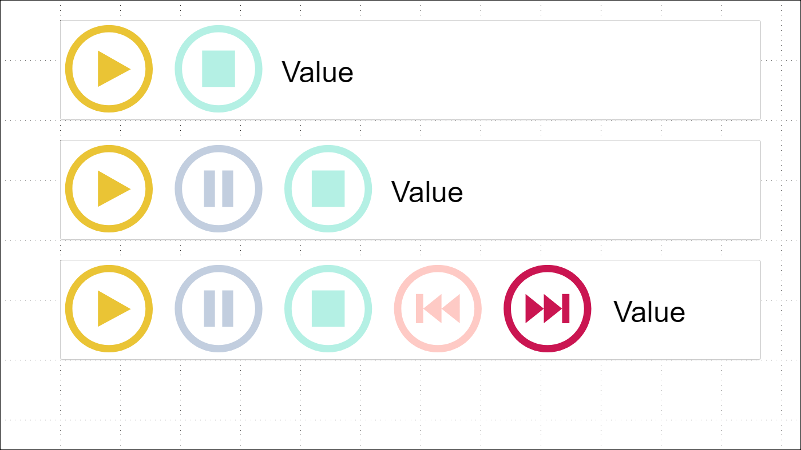

# PlayAxis Cumulative

A Power BI slicer based on the original <a href="https://github.com/mprozil/PlayAxis">PlayAxis slicer</a> however with the following enhancements:
* Supports option to display values cumulatively
* Supports option to show/hide the previous & next buttons
* Supports option to combine the play & pause buttons into a single button
* Extended the time available to select between sequences (min = 10ms, max = 999,999ms)

Simple Power BI visual that works like a dynamic slicer, animating other visuals. It has controls like "play", "pause", "stop", "previous" and "next" allowing a report and its visuals to play with less user interaction. 

This visual accepts any parameter to be played and has some settings like colours, font size and transitions options, to be customized by the user.

